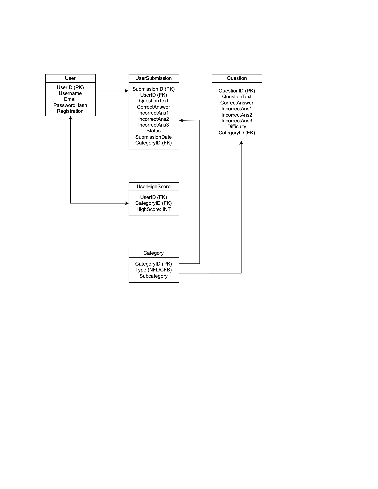

# UML Diagram

# Entities

1. **User**: Stores account details. Modeled as an entity because it’s a central actor with attributes like email and password
2. **Question**: Stores pre-generated trivia questions (from Kaggle scripts). Modeled as an entity to separate questions from user submissions
3. **UserSubmission**: Tracks user-submitted questions. Separate from Question to distinguish approved vs. pending content
4. **Category**: Defines trivia topics (e.g., “NFL-SuperBowl” or “CFB-Heisman”). Important for filtering questions and tracking high scores
5. **UserHighScore**: Tracks a user’s best score per category. Modeled as an entity to support many-to-many relationships between users and categories

# Relationship Types

- User → UserSubmission: 1-to-Many
  - One user can submit many questions, but each submission belongs to one user
- User ↔ UserHighScore: Many-to-Many
  - A user can have high scores in multiple categories, and a category can have high scores from multiple users
- Question ← Category: Many-to-1
  - Many questions can belong to one category (e.g. 100 questions about “NFL-MVP”)
- UserSubmission ← Category: Many-to-1
  - Similar to Question

# Normalization (BCNF)

All tables adhere to Boyce-Codd Normal Form. No non-trivial functional dependencies exist where the determinant is not a superkey.

- User
  - FDs: UserID → {Username, Email, PasswordHash, RegistrationDate
  - UserID (primary key) uniquely determines all other attributes. No other functional dependencies exist
- Category
  - FDs: CategoryID → {Type, Subcategory}
  - CategoryID (primary key) uniquely determines Type and Subcategory
- Question
  - FDs: QuestionID → {QuestionText, CorrectAnswer, IncorrectAnswer1, IncorrectAnswer2, IncorrectAnswer3, Difficulty, CategoryID}
  - QuestionID (primary key) uniquely determines all question-related attributes
- UserSubmission
  - FDs: SubmissionID → {UserID, QuestionText, CorrectAnswer, IncorrectAnswer1, IncorrectAnswer2, IncorrectAnswer3, Status, SubmissionDate, CategoryID}
  - SubmissionID (primary key) uniquely determines all submission attributes
- UserHighScore
  - FDs: {UserID, CategoryID} → HighScore
  - The composite key {UserID, CategoryID} uniquely determines HighScore

# Relational Schema

User(UserID:INT [PK], Username:VARCHAR(50), Email:VARCHAR(100), PasswordHash:VARCHAR(255), RegistrationDate:DATETIME)

Category(CategoryID:INT [PK], Type:VARCHAR(3) [NFL/CFB], Subcategory:VARCHAR(50) [e.g., "SuperBowl", "Heisman"])

Question(QuestionID:INT [PK], QuestionText:TEXT, CorrectAnswer:VARCHAR(255), IncorrectAnswer1:VARCHAR(255), IncorrectAnswer2:VARCHAR(255), IncorrectAnswer3:VARCHAR(255), Difficulty:VARCHAR(20), CategoryID:INT [FK to Category.CategoryID])

UserSubmission(SubmissionID:INT [PK], UserID:INT [FK to User.UserID], QuestionText:TEXT, CorrectAnswer:VARCHAR(255), IncorrectAnswer1:VARCHAR(255), IncorrectAnswer2:VARCHAR(255), IncorrectAnswer3:VARCHAR(255), Status:VARCHAR(20) [Pending/Approved/Rejected], SubmissionDate:DATETIME, CategoryID:INT [FK to Category.CategoryID])

UserHighScore(UserID:INT [FK to User.UserID], CategoryID:INT [FK to Category.CategoryID], HighScore:INT, PRIMARY KEY (UserID, CategoryID))
