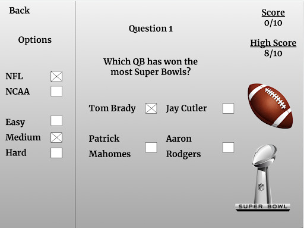
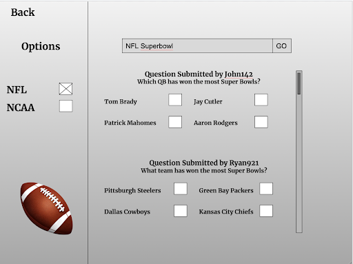
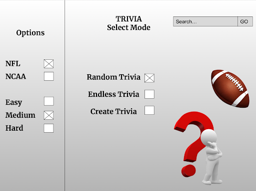

# Sports Trivia App

## Project Summary

The Sports Trivia App is an web application that provides trivia games featuring football questions for sports fans to test their knowledge of football events. The app compiles trivia questions based on official match data while also allowing users to contribute their own creative trivia. With a specific focus on football events such as NFL and college football, the Sports Trivia App is an interactive educational tool to add value to the football community.

## Description

The way the application would work would be people can visit the app and choose what they want to do. They can do random trivia, endless trivia, create a trivia, or find someone’s trivia that they made using a search. There are also options to choose NFL, college football, or difficulty in questions. When random trivia is selected, there are 10 random questions that are selected from a database of questions that the person is quizzed on. The multiple choice answers are pulled from a database that is tied to the question and the correct answer will always be available while the other 3 answers can be anything. For example, for the question who has won the most Super Bowls, Tom Brady would always be an option since it is correct. The other options would be 3 random options from a database of 5 other players such as Jay Cutler, Patrick Mahomes, Travis Kelce, Jason Kelce, and Aaron Rodgers. For unlimited trivia, questions will be asked until the player gets one wrong. For both of these, the person’s high score will be saved for the specific category.

When making trivia questions, a creator can make a question with options for answers and choose which one is the correct answer. They can have more than just three wrong answers and the program will choose a random three for the other wrong answers similar to random trivia. Lastly, the search bar can find trivia that other people have made. You can search a question and find who posted it and what the correct answer is for it. You can also use the search to find people and where they stand on the leaderboards for the different types of trivia.

## Creativity

To make the app more than just a sports trivia webpage for self-testing, several features for socialization are intended to be added to the app to increase inter-user interaction and boost organic growth. The app contains leaderboards for quizzes to keep track of user’s performances and rank them based on metrics such as accuracy, knowledge breadth, engagement etc. Such features can encourage users to stay active and learn more about the trivia of football while trying to climb to the top of leaderboards.

Inspired by products such as Quizlet, the app is also to implement features that can take user input and allow sharing among users. Other than simply answering questions from the existing database, users can also contribute to the app by submitting trivia questions and compiling their own trivia sets. A set created by users can be shared with a link to friends or the public while an independent leaderboard will keep track of users’ performances for this specific set.

For user privacy and to collect the minimal amount of user data as possible, these features will not be based on an account-based authentication system. Instead, the app makes use of temporary sessions such as browser cookies to keep track of user activities when necessary.

## Usefulness

The sports trivia web app serves as a dedicated platform for NFL and College Football enthusiasts to test their knowledge and engage with the rich history of both sports. Users can participate in trivia quizzes focused on major seasonal accolades (e.g., Heisman Trophy winners, MVPs, Super Bowl champions, and College Football National Championship outcomes) and track their performance over time. The app’s basic functions include answering timed trivia questions across difficulty levels, competing on a global leaderboard, and reviewing personalized stats that highlight a user’s strengths. A standout feature of our web app is the ability for users to submit their own questions (subject to moderation), fostering a community-driven database that grows organically. Unlike generic trivia platforms, our app caters specifically to football fans, offering deep dives into niche historical data and achievements that broader apps often overlook.

While platforms like Sporcle or Fun Trivia offer sports trivia, they lack specialization in football history and user-driven content. Our app will differentiate itself through three key elements:
Niche Expertise: Exclusive focus on NFL and College Football accolades, appealing to hardcore fans
Community Contribution: Users can submit questions, building fresh content and boosting community engagement
Personalized Analytics: Detailed stats to help users track progress in specific categories

## Realness

In order to build a real sport trivia application focused on NFL and College Football fans, we locate two databases that provide us data about each match, team, and player. One is from Pro-Football-Reference website, which can offer us extensive historical data about NFL players, teams, and games. The other database is from a sports-reference website, which also provides lots of data about college football historical games, including player, school, and conference stats, awards, records. Both websites are builded by sports-reference.com. Beside detailed data for each team such as team score or player score, we can even get the leaderboard for each statistics contribution like pass completion or touchdowns. One convenient thing that this website provides is that it contains data for hundreds of years, and we can find detailed data about each teams and players’ score with a visualized downloadable table, so we can convert those tables to csv, xsl file, or even a link to table(json file) for using API. The data size would be around thousands to ten of thousands records and tens of attributions for each game or teams.

Dataset websites:

- https://www.pro-football-reference.com/
- https://www.sports-reference.com/cfb/

## Functionality

The images below show what three of the pages would look like. The main page would have checkboxes on the left that would be able to customize the types of trivia that will be done. This includes difficulty and NFL or NCAA. Each question would have multiple pieces of information attached to it including these customizations, so that trivia questions can be selected. They can choose what they would like to do, including searching for other people’s trivia questions. They can search on the top right which takes them to another page which more clearly can show different people’s trivia questions that have been uploaded. They can also create a new trivia question or go to their profile and delete trivia questions they made but don’t want to use anymore. They are able to edit their trivia questions they already created as well if they want to. People can also search other users to see their personal best scores as well as a leaderboard that shows the highest scores.

The user will have all four CRUD operations.
The user will be able to create new questions to upload to the database. There will be options such as difficulty level and type of question (NCAA or NFL) that they can select to better categorize the question they are making.
The user will be able to read other questions that have been uploaded. Using the search bar they are able to see what other people have created and the questions that are in the database.
The user can update their own questions after uploading to the database. They can edit what type of question it is in case they misclicked or they want to change how difficult it is.
The user can delete the questions they have uploaded. If a user finds their question to be boring or it is completely wrong, they can delete it from the database and create a new one. 

### UI Mockup

## Project Work Distribution

- Ryan: Web frontend implementation
- Kiernan: API endpoints and routing
- Zihao: Database schema design and query writing
- Shiyuan: Cloud infrastructure design and hosting
